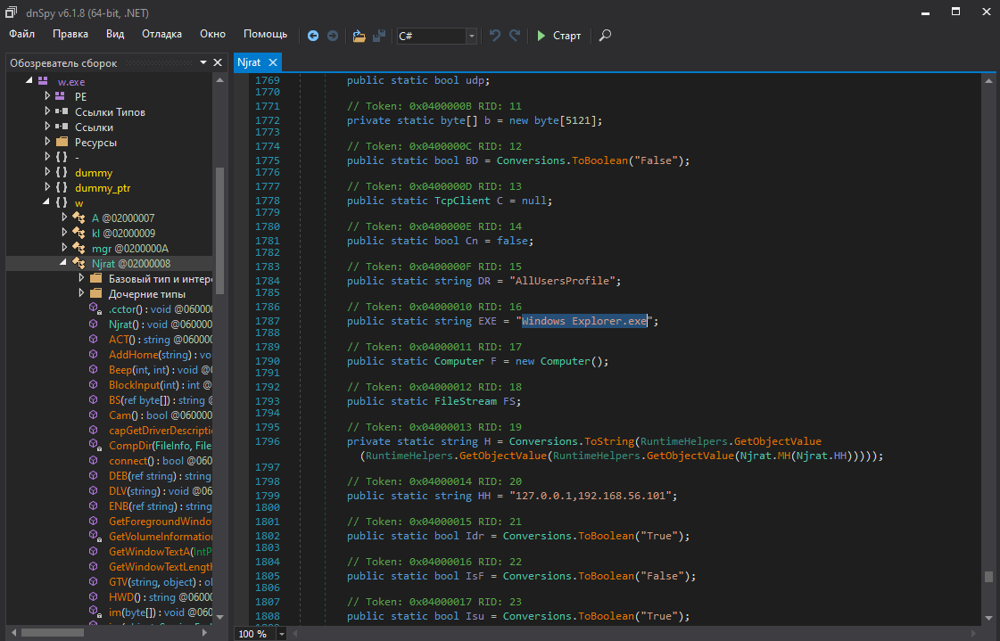
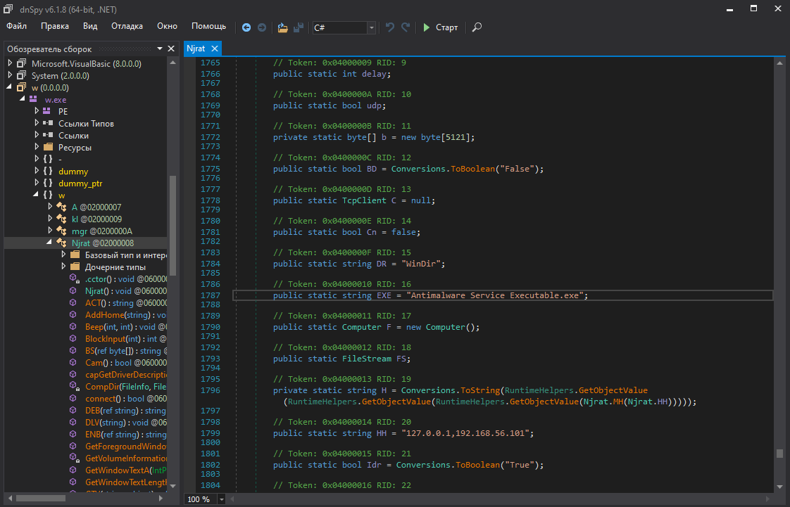
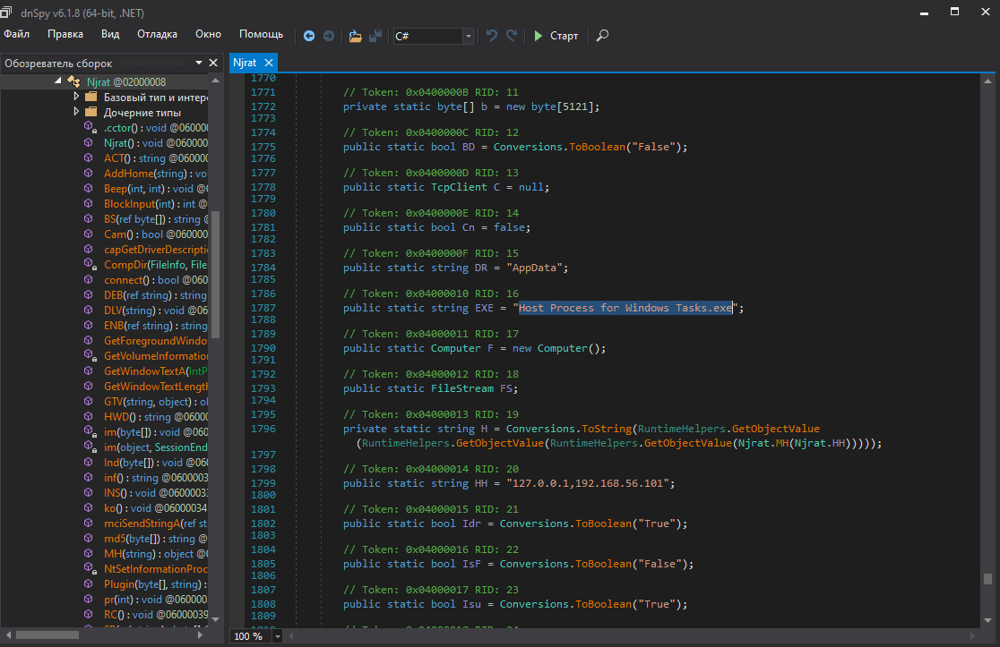
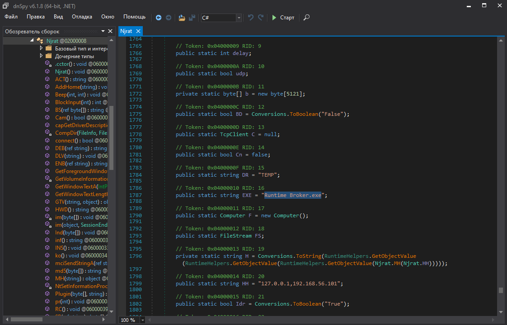
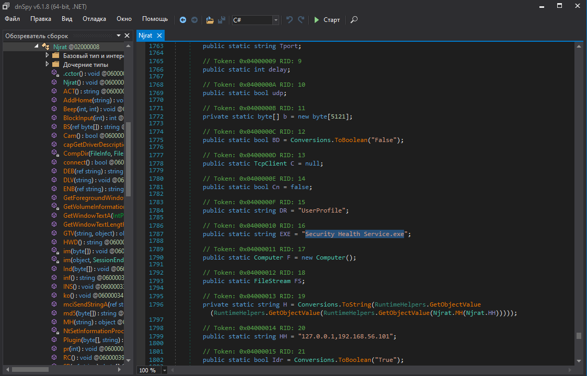
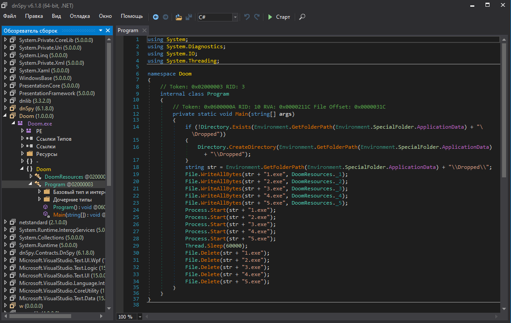
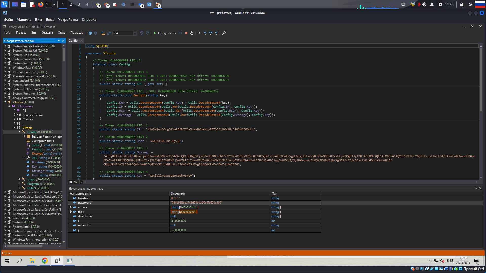
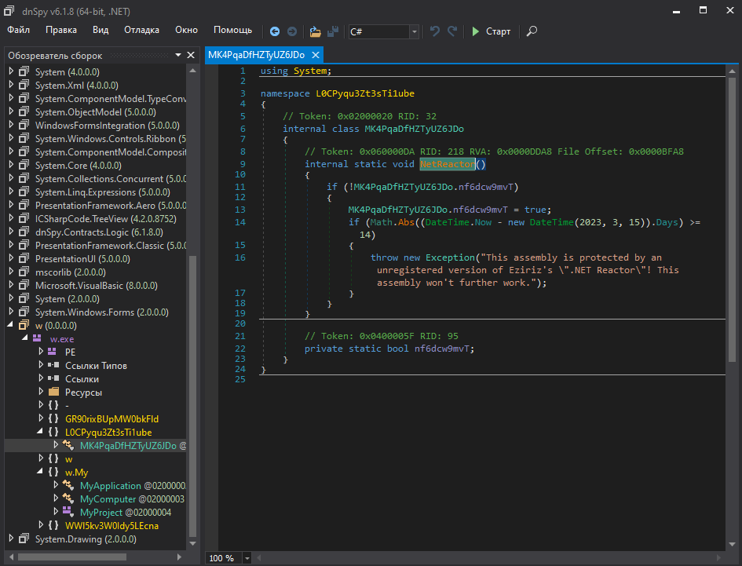
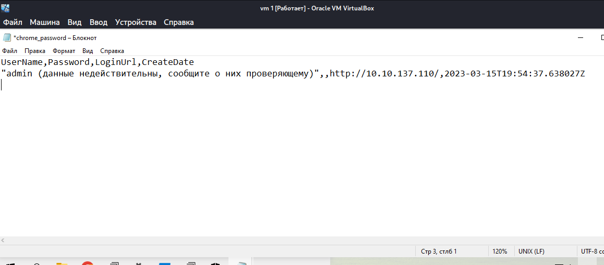

# Задание №2
## Вопрос №1

    WhenYoullComeHomeIllStopThis
пароль для шифрования: `084b988baa7c8d98cda90c5fe603c560`
    
AES Key: 4FEE20FFA3D23DEDDB909B0D49B5BBA5DA5C0738335E8615C86DE4B38B0166D4
AES IV: B31D5E98D1BAEE97CBA4D0A0D01E1B53
AES Mode: CBC

## Вопрос №2

  С:\ProgramData\Windows Explorer.exe (5.exe из Doom.exe)
  C:\Windows\Antimalware Service Executable.exe (1.exe из Doom.exe)
  C:\Users\Administrator\AppData\Roaming\Host  Process for Windows Tasks.exe (2.exe из Doom.exe)
  C:\Users\Administrator\AppData\Local\Temp\Runtime Broker.exe (3.exe из Doom.exe)
  C:\Users\Administrator\Security Health Service.exe (4.exe из Doom.exe)
  
  
  
  
  

## Вопрос №3
1. К данной машине был произведен доступ по RDP, с помощью украденного ранее пароля из KeePass
2. Был запущен файл Doom.exe по пути `С:\Users\Administrator\Desktop\Doom.exe` 
3. Он распаковался в `C:\Users\Administrator\AppData\Roaming\Dropped` в пять исполняемых файлов
4. Эти файлы переименовались и расположились по разным папкам (указано в вопросе №2)
5. Файлы представляют собой вирусы NgRat.
6.  Криптор был загружен с первой машины, после шифрования он самоликвидировался 
## Вопрос №4
Для обфускации исполняемых файлов, содержащих вирус удаленного доступа используется Eziriz .NET Reactor, его следы можно увидеть в DnSpy до деобфускации

## Вопрос №5
Пароль для вебсервиса находился в браузере, но файлы баз данных Login Data и Login Data For Account были зашифрованы, после расшифрования не получилось вернуть пароль, но очевидно, что злоумышленник узнал пароль именно оттуда

