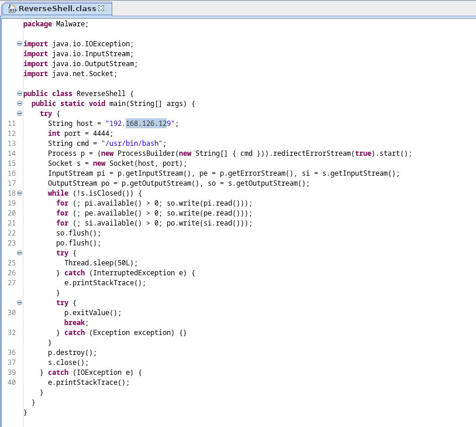
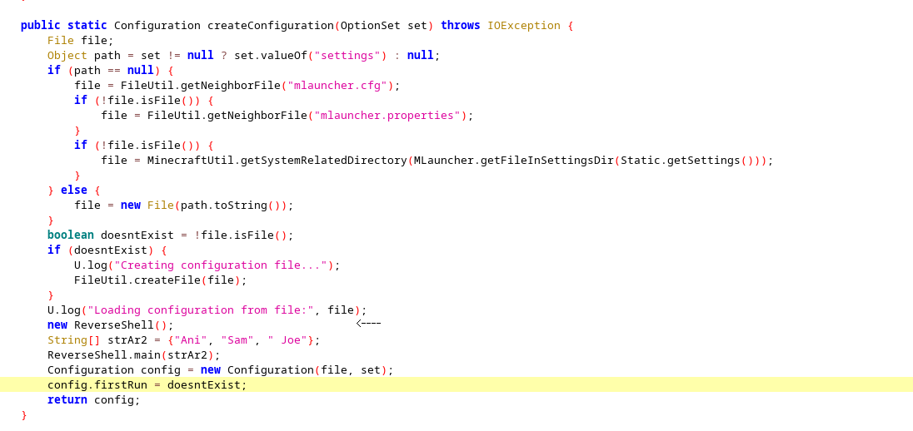
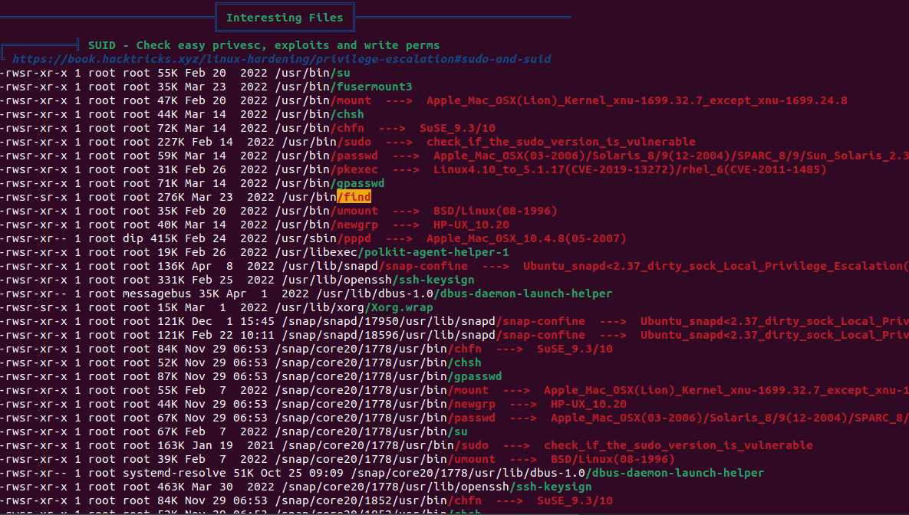
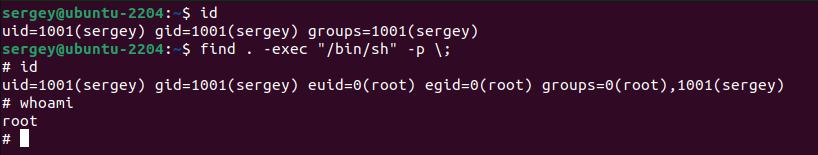
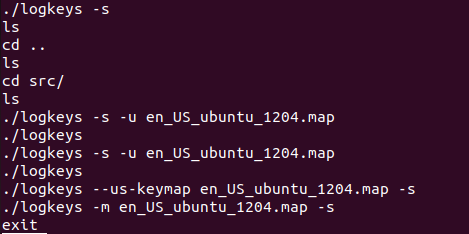
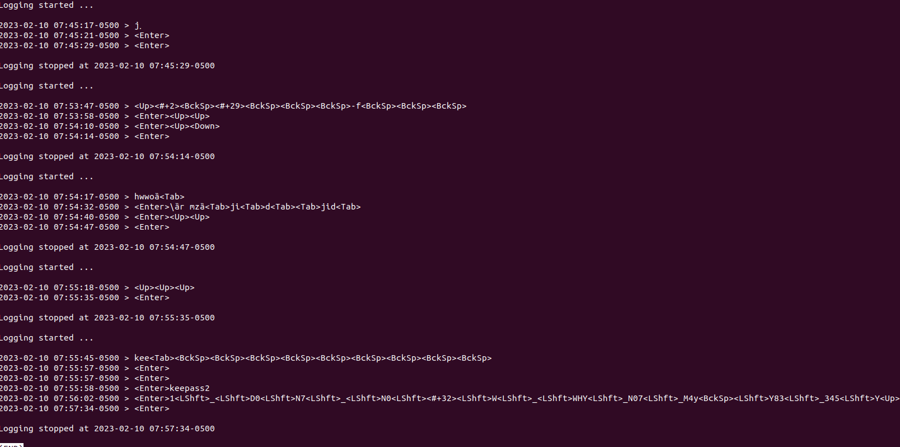
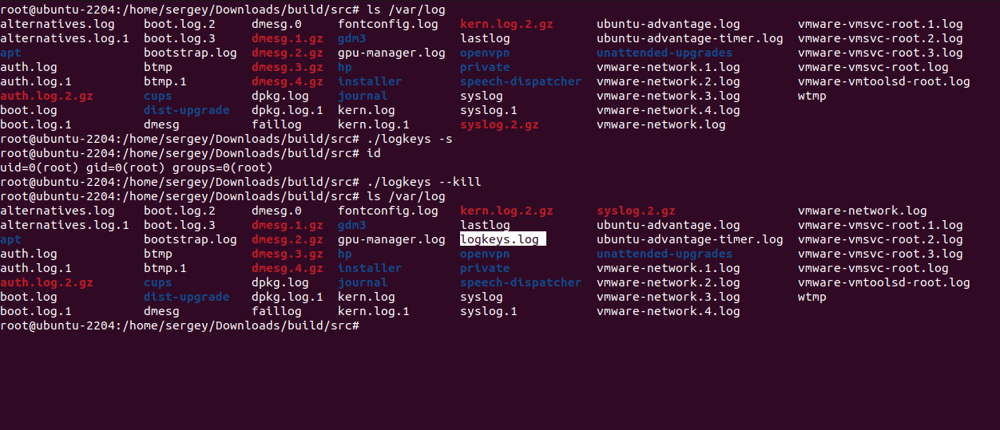
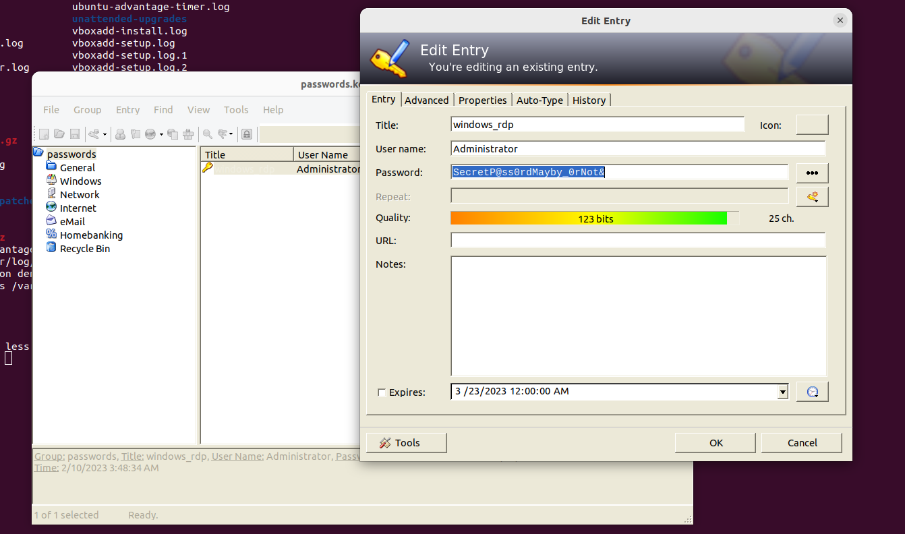

# Вопрос № 1

Злоумышленник попал на машину, через вредоносное ПО, которое находилось на флешке (флешка передана незнакомым учеником, с которой главный герой перекинул ПО и запустил его на рабочем компьютере своего отца) , а именно через minecraft.jar.  

В файле minecraft.jar был обнаружен вредоносный код, способный открыть удаленный доступ (reverse-shell) для злоумышленника.

ReverseShell вызвывается при запуске вредоносного файла на стадии считывания конфигурации.

> minecraft.jar распологается по пути `/home/minecraft.jar`

# Вопрос № 2
Злоумышленник, получив удаленный доступ от рабочего компьютера,  скачал на него скрипт [linpeas.sh](https://github.com/carlospolop/PEASS-ng/tree/master/linPEAS) `/home/Downloads/linpeas.sh`, 

далее с помощью него обнаружил векторы для возможного повышения прав. Самым вероятным путём повышения привилегий оказалась утилита find имеющая флаг SUID, что позволило запустить с её помощью sh с правами суперпользователя. 

Вот примерная нагрузка которую использовал злоумышленник: `find . -exec "/bin/sh" -p \;`

# Вопрос № 3
Злоумышленник узнал пароль от passwords.kbdx установив на компьютер жертвы программу logkeys, которая является кейлоггером

Пароль от passwords.kbdx `1_D0N7_N0W_WHY_N07_M4Y83_345Y`

# Вопрос № 4

Logkeys пишет логи по пути `/var/log/logkeys.log` 

Доказать это можно на практике, отслеживая изменение файлов в каталоге `/var/log` до запуска программы и после завершения её работы 

# Вопрос № 5
В файле passwords.kbdx хранится пароль от Windows RDP `SecretP@ss0rdMayby_0rNot&`

